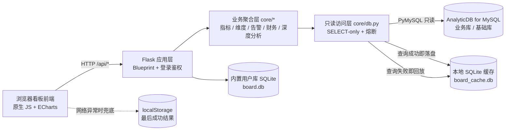

# 换电运营平台 · 多板块数据看板

> 面向两轮车「换电 + 租车」业务的运营数据看板系统。后端从 AnalyticDB（MySQL 协议）业务库**只读**抽取换电柜、电池、用户、网点、销售、财务等数据，聚合为 12 个业务板块、60+ 个看板 API；前端为原生 JS + ECharts 单页应用。
>
> 核心特性：**断库容灾缓存** —— 业务库不可达时回放最近一次成功查询的数据，运营值班期间看板不白屏、不报错。

`Python 3.11` · `Flask` · `PyMySQL` · `SQLite` · `原生 JS / ECharts（本地化，零外网依赖）`

---

## 1. 项目背景

两轮车换电 / 租车业务的日常运营，需要同时回答几类问题：今天换电量和营收怎么样？哪个城市、哪个网点、哪个客户经理的业绩在下滑？电池有没有饿死、换电柜有没有烟感水浸告警？用户的押金、套餐、协议、优惠券核销情况如何？

这些数据分散在生产业务库的多张表里，且存在几个现实约束：

| 约束 | 设计要求 |
|------|----------|
| 业务库是生产库，不允许任何写入，也不允许看板把库拖慢 | 全链路**只读**，查询必须走统一访问层，禁止写语句 |
| 使用方角色多（运营、客户经理、客服、管理层），视角与权限不同 | 按板块划分权限点 + 按客户范围做数据隔离 |
| 值班期间业务库可能抖动、网络可能中断 | 看板必须**看到最近一次数据**，不能白屏 |
| 部署在内网 / 值班大屏，环境常无外网 | 前端资源全部本地化，不依赖 CDN |

因此项目的目标不是"再做一个报表页"，而是做一个**在内网、只读、多角色、可降级**的运营数据出口。

---

## 2. 功能板块

| 板块 | 主要内容 |
|------|----------|
| 数据大屏 | 全屏可视化大屏（核心运营指标 + 城市分布） |
| 数据总览 | 运营总览 / 城市维度 / 网点维度 / 设备维度 / 财务维度 / 换电密集分布 / 车辆密集分布 |
| 用户看板 | 用户总览 / 增长分析 / 单用户视图 / 用户分布地图 / 用户基本表 / 实时全量查询 |
| 销售看板 | 销售总览 / 网点销售情况 / 业务销售业绩 / 套餐购买明细 / 协议签约明细 / 名下网点 |
| 网点看板 | 网点总览 / 收支对账单 / 网点评估与发展 / 网点基本表 / 单网点视图 |
| 设备资产看板 | 换电柜 / 电池 / 车辆 / 仓库 / 流通 / 调拨 / 出入库 / 故障 |
| 优惠券看板 | 优惠券发放与核销概览 |
| 财务看板 | 收入趋势 / 支出明细 / 押金明细 |
| 运维看板 | 设备汇总 / 告警明细（电池饿死、断充、烟感、水浸、仓位） |
| 人员看板 | 人员业绩 / 工单 |
| 客服服务台 | 实时查询 / 投诉工单 |
| 深度分析 | 换电高峰 / 首次取电 / 电池龄 / 支出对比 |

---

## 3. 技术架构



分层职责：

- **web/**：单页前端，原生 JS 手写路由与请求封装，ECharts 本地文件引入
- **api/routes.py**：REST 接口层，按板块划分路由，统一鉴权装饰器与统一响应结构
- **core/**：业务聚合层，按主题拆分（overview / metrics / dimensions / business / devices / finance_assets / alarms / bigscreen）
- **core/db.py**：只读访问层，强制 SELECT-only 校验 + 连接熔断 + 缓存回放
- **core/cache.py**：稳定 key 计算与本地 SQLite 缓存读写
- **auth/**：内置用户库（SQLite），用户 / 角色 / 权限点 / 登录装饰器

---

## 4. 核心亮点

### 4.1 断库容灾：三级兜底

业务库不可达时，看板按以下顺序取数，任一环节命中即正常渲染：

1. **服务端缓存回放**：每次查询成功即把结果按稳定 key 落盘到本地 SQLite；查询失败时回放最近一次成功结果，响应中标记 `cached: true` 与 `cached_at`
2. **连接熔断**：建连失败后短时熔断（60s），避免断库期间每个请求都空等超时，前端不至于卡死
3. **浏览器兜底**：前端统一请求封装在网络错误 / 非 JSON / 业务码异常三种情况下，回放 localStorage 中最后一次成功结果，并显示降级横幅

配合前端统一的"缓存中"标识，值班人员能明确知道"看到的是历史数据"。

### 4.2 稳定缓存 key

同一个业务查询在不同时刻必须命中同一条缓存，否则容灾缓存会被时间戳打散。`core/cache.py` 将 SQL 与参数**归一化**后取 SHA1：把毫秒级时间戳字面量替换为固定占位符，再拼接参数，保证同一业务查询的 key 稳定。

### 4.3 只读安全

- 所有查询必须经过 `core/db.py` 的 `query()`，非 `SELECT` / `WITH` 语句直接抛错
- 数据库账号使用只读账号，凭据只经内存读取，不写日志、不回显前端、不落库
- 连接超时 / 读超时显式设置，避免慢查询拖垮看板线程

### 4.4 零外网依赖

ECharts 等前端资源以本地文件引入，适合完全内网的值班环境部署。

---

## 5. 快速开始

```bash
pip install -r requirements.txt
cp .env.example .env          # 按实际环境填写数据库凭据
python -m scripts.init_db     # 初始化内置用户库（创建初始管理员）
python app.py                 # 启动，默认 http://0.0.0.0:8092
```

浏览器访问 `http://<本机IP>:8092`，使用 `.env` 中配置的管理员账号登录。

> 若业务库不可达：首次启动无缓存时看板为空数据；已有缓存时自动回放最近一次成功结果（页面显示"缓存中"标识）。

---

## 6. 配置

### 6.1 数据库凭据（`.env`，已排除在版本库外）

```
DB_HOST=your_host
DB_PORT=3306
DB_USER=your_user            # 建议使用只读账号
DB_PASSWORD=your_password
DB_NAME=your_business_db     # 业务库
DB_BASE=your_base_db         # 基础库（客户主数据）
BOARD_HOST=0.0.0.0
BOARD_PORT=8092
SECRET_KEY=随机字符串
ADMIN_USER=admin
ADMIN_PASSWORD=初始管理员密码
```

凭据仅由 `config/settings.py` 在内存中读取，不写入日志、不回显前端、不落库。

### 6.2 业务配置（`config/config.yaml`）

| 配置项 | 说明 |
|--------|------|
| `database.tables` | 业务别名 → 逻辑表名（真实物理表名见 6.3） |
| `alarm.battery.hungry.voltage_threshold` | 电池饿死判定电压阈值 |
| `priority` | 告警优先级（数字越小越优先） |
| `event_type_map` | 事件类型 → 业务告警名称 |

### 6.3 表名映射（逻辑表名 → 物理表名）

仓库内**只保留逻辑表名**（`t_site`、`t_exchange_order` …），真实物理表名不随源码外泄，通过本地文件 `config/schema.local.yaml`（已列入 `.gitignore`）注入：

```yaml
# config/schema.local.yaml（本地文件，不提交）
tables:
  t_site: your_site_table
  t_exchange_order: your_order_table
```

运行期由 `core/db.py` 调用 `core/schema.py`，在 SQL 执行前完成「逻辑名 → 物理名」替换；缓存 key 基于替换后的 SQL 计算，与历史缓存保持一致。未提供该文件时按逻辑表名原样执行，便于对接任意库表结构。

---

## 7. 断库容灾机制详解

1. **稳定缓存 key**：`core/cache.py` 将 SQL 与参数归一化（毫秒时间戳字面量替换为固定占位符）后取 SHA1，保证同一业务查询在不同时刻生成相同 key。
2. **成功即落盘**：`core/db.py` 每次查询成功后将结果 upsert 进本地 SQLite 缓存（上限 3000 条，自动淘汰最旧），记录 `cached_at`。
3. **失败即回放**：查询失败时回退最近一次成功结果，接口响应附带 `cached: true` 与 `cached_at`；连接失败短时熔断，避免断库期间整站请求排队等超时。
4. **前端兜底**：`web/js/app.js` 统一请求封装在「网络错误 / 非 JSON / 业务码异常」三种情况下回放 localStorage 最后成功结果，并显示降级横幅，不白屏、不报错。

> 断库期间仅能看历史数据；连接恢复后首次加载即自动刷新缓存。

---

## 8. 角色与权限

| 角色 | 说明 |
|------|------|
| 管理员 admin | 全部数据 + 用户 / 角色管理 |
| 客户经理 manager | 仅查看其客户范围（`oem_ids`）内的数据 |
| 查看者 viewer | 只读看板 |

权限点按板块划分（如 `overview:view`、`user:view`、`sales:view` …），支持在「角色管理」中自定义角色。

---

## 9. API 概览

| 分组 | 路径前缀 | 说明 |
|------|----------|------|
| 认证 | `/api/auth/*` | 登录 / 登出 / 当前用户 |
| 总览 | `/api/overview/*`、`/api/dashboard/*` | 运营总览、趋势、城市 / 网点 / 设备 / 财务维度 |
| 用户 | `/api/users/*` | 用户汇总、增长、明细、分层、协议、订单 |
| 销售 | `/api/sales/*` | 销售汇总、网点排名、员工业绩、套餐、协议 |
| 网点 | `/api/sites/*` | 网点汇总、列表、订单 |
| 设备资产 | `/api/assets/*`、`/api/devices/*` | 换电柜、电池、调拨、工单 |
| 财务 | `/api/finance/*` | 收支趋势、支出明细、押金 |
| 运维 / 告警 | `/api/alarms`、`/api/service/*` | 告警明细、服务台查询、投诉 |
| 分析 | `/api/insights/*` | 换电高峰、首次取电、电池龄 |
| 大屏 | `/api/bigscreen/*` | 大屏聚合数据 |
| 系统 | `/api/health`、`/api/filters/options` | 连通性检查、筛选项字典 |

---

## 10. 目录结构

```
board/
├── app.py                  # Flask 入口（应用工厂）
├── config/                 # settings.py（.env 加载）+ config.yaml（业务配置）
├── core/                   # db 只读访问层 / cache 断库缓存 / 各板块统计逻辑
├── auth/                   # 内置用户库：用户、角色、权限、登录装饰器
├── api/routes.py           # REST API
├── web/                    # 前端（index.html / js / css / ECharts）
└── scripts/init_db.py      # 初始化用户库
```

---

## 11. 安全与合规

- 数据库凭据仅存于 `.env`，代码零硬编码，日志与前端不回显
- 内置用户库为独立 SQLite，密码哈希存储，与业务库凭据隔离
- 仓库内只保留**逻辑表名**，真实物理表名由本地 `config/schema.local.yaml` 注入（已 `.gitignore`），不随源码外泄
- 业务数据缓存、内置用户库、运行日志、真实业务截图均已在 `.gitignore` 中排除，不会被提交
- 服务默认监听 `0.0.0.0`，建议通过防火墙 / 白名单限制访问来源；公网部署请前置 HTTPS

---

## 12. 说明与声明

- 本仓库为**个人作品集展示**用途，用于呈现该运营看板的架构设计与工程实现思路
- 仓库内**不包含**任何真实业务数据、消费者个人信息、数据库凭据或账号口令；配置样例均为占位符
- 库表名与字段映射仅为示例结构，与任何真实生产环境无关
- 未附带开源许可（仅供学习与交流参考），转载请注明出处
